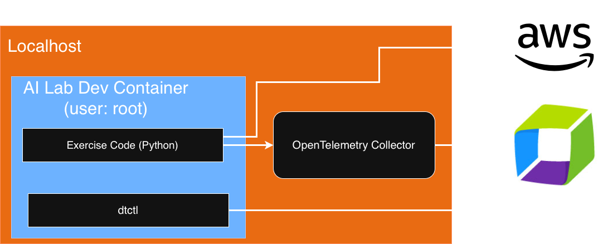

# Setup

## Step 0: Fork this repository

**You do not have write access to the source repository.** Fork it into your own GitHub account first — you'll need your own copy to store credentials.

1. Go to the repository on GitHub
2. Click **Fork** (top right)
3. Accept the defaults and click **Create fork**

Use your fork for everything below.

## Step 1: Gather your credentials

Collect these before starting Step 2.

### AWS credentials

The tutorial code calls AWS Bedrock Mantle, so you need AWS credentials with permission to invoke Bedrock models.

#### Required IAM permissions

Whichever credential type you use, the IAM identity needs the following policy. The `bedrock:InvokeModel` action covers standard calls; `InvokeModelWithResponseStream` covers the streaming exercises.

```json
{
  "Version": "2012-10-17",
  "Statement": [
    {
      "Effect": "Allow",
      "Action": [
        "bedrock-mantle:CallWithBearerToken"
      ],
      "Resource": "*"
    },
    {
      "Effect": "Allow",
      "Action": [
        "bedrock-mantle:CreateInference"
      ],
      "Resource": "arn:aws:bedrock-mantle:us-east-2:*:project/default"
    }
  ]
}
```

#### Option A: IAM Identity Center (recommended)

If your organisation uses IAM Identity Center (SSO), ask your AWS administrator to attach a permission set containing the policy above to your account. Your credentials will be short-lived and rotate automatically — no keys to manage.

Once access is granted, log in:

```bash
aws sso login --profile your-profile-name
```

Note the profile name — you'll use it in Step 2 if your credentials are not already in `~/.aws`.

#### Option B: IAM user with access keys

Use this if you have a personal AWS account or your organisation doesn't use IAM Identity Center.

1. In the [IAM console](https://console.aws.amazon.com/iam/), go to **Policies → Create policy**
2. Switch to the **JSON** editor, paste the policy above, and save it with a name like `BedrockInvokePolicy`
3. Go to **Users → Create user**, give it a name (e.g. `ai-lab`), and attach the `BedrockInvokePolicy` you just created
4. Open the new user, go to **Security credentials → Create access key**, choose **Other**, and download the key

You'll have an `AWS_ACCESS_KEY_ID` (starts with `AKIA`) and `AWS_SECRET_ACCESS_KEY`. Note both — you'll need them in Step 2.

!!! warning "Access keys don't expire"
    Delete this user and its keys when you're done with the lab. Never commit them to git.

### Dynatrace API token

The OTel Collector uses this to send traces and metrics to your Dynatrace environment.

1. In Dynatrace, press `Ctrl / Cmd + k` and search for **Access tokens**
2. Click **Generate new token**, name it (e.g. `otel-collector-local`), and add:
    - `openTelemetryTrace.ingest`
    - `metrics.ingest`
3. Click **Generate token** and copy it immediately — you won't see it again

### Dynatrace platform token

The `dtctl` CLI uses this to run DQL queries.

1. Go to `https://myaccount.dynatrace.com/platformTokens`
2. Click **Generate token**, name it (e.g. `dtctl-local`), and add:
    - `storage:metrics:read`
    - `storage:spans:read`
    - `storage:buckets:read`
3. Click **Generate** and copy it immediately

### Your tenant ID

Your Dynatrace environment URL looks like `https://abc12345.live.dynatrace.com` or `https://abc12345.apps.dynatrace.com`. The `abc12345` part is your **tenant ID** — you'll need it too.

---

## How it fits together

Before choosing your environment, here is what you are setting up:



Everything runs inside **two containers** on your machine:

| Container | What it does |
|---|---|
| **AI Lab Dev Container** | Runs your exercise Python code and the `dtctl` CLI |
| **OpenTelemetry Collector** | Receives telemetry from your code and forwards it to Dynatrace |

Docker Desktop is the only thing you install on your host machine. When the lab is over, stop and delete both containers — your machine is unchanged.

Two external services are involved:

- **AWS Bedrock** — the AI model API your exercise code calls
- **Dynatrace** — receives and stores all traces, metrics, and logs; `dtctl` queries it directly

This is why you need **four credentials** in Step 1: two for AWS (to call Bedrock), two for Dynatrace (one to push telemetry, one to query it).

---

## Step 2: Start the dev container

Requires [Docker Desktop](https://www.docker.com/products/docker-desktop/) and [VS Code](https://code.visualstudio.com/) with the [Dev Containers extension](https://marketplace.visualstudio.com/items?itemName=ms-vscode-remote.remote-containers).

1. Clone your fork:

    ```bash
    git clone https://github.com/YOUR_USERNAME/REPO_NAME.git
    cd REPO_NAME
    ```

2. Copy the environment template and fill in your Dynatrace values:

    ```bash
    cp .devcontainer/.env.example .devcontainer/.env
    ```

    ```
    DT_TENANT=abc12345
    DT_API_TOKEN=dt0c01.XXXX...
    DTCTL_PLATFORM_TOKEN=dt0s16.XXXX...
    ```

3. **AWS credentials:** the dev container mounts your `~/.aws` folder automatically. If you previously ran `aws configure` or `aws sso login`, your credentials are already available inside the container — nothing else to do. If not, add them to `.devcontainer/.env` as well:

    ```
    AWS_ACCESS_KEY_ID=AKIA...
    AWS_SECRET_ACCESS_KEY=...
    AWS_SESSION_TOKEN=...
    AWS_REGION=us-east-2
    ```

4. Open the folder in VS Code and run **Dev Containers: Reopen in Container** from the command palette. Wait for the container to build — the OTel Collector starts and `dtctl` is configured automatically.

## Step 3: Verify the pipeline

**Do this before starting any exercise.** Every lab depends on this pipeline working.

```bash
python code/smoke-test.py
```

The script runs **two checks** and exits non-zero if either fails.

**Check 1** confirms that your exercise code can reach the OTel Collector and that telemetry is accepted. **Check 2** confirms that your AWS credentials are valid and that the Bedrock model responds.

Expected output when both pass:

```
============================================================
Check 1: OTel Collector pipeline
  Sending to: http://localhost:4318
  Span recorded:   smoke-test
  Metric recorded: smoke_test.runs +1
[OK] OTel Collector pipeline: telemetry accepted by collector

============================================================
Check 2: AWS Bedrock connection
  Model replied:   'OK'
[OK] AWS Bedrock connection: model reachable and responding

============================================================
Both checks passed. Wait ~60 s then verify data reached Dynatrace:
  ...
```

If Check 1 fails with a connection error, the OTel Collector is not reachable on port 4318 — re-check Step 2.4 and confirm the container built successfully.

If Check 2 fails, follow the error message: either your AWS credentials are not set (`AWS_ACCESS_KEY_ID` / `AWS_SECRET_ACCESS_KEY` / `AWS_REGION`), or the IAM identity lacks `bedrock:InvokeModel` permission.

Wait about **60 seconds**, then run:

```bash
dtctl query 'fetch spans
| filter service.name == "otel-smoke-test"
| fields startTime, span.name, duration, service.name
| sort startTime desc
| limit 5'
```

```bash
dtctl query 'timeseries runs = sum(smoke_test.runs), by: {service.name}
| filter service.name == "otel-smoke-test"
| fieldsAdd total_runs = arraySum(runs)
| fields service.name, total_runs'
```

!!! success "Both queries return data?"
    Your end-to-end pipeline is confirmed. Choose your path below.

!!! failure "One or both queries return nothing?"
    1. Check the OTel Collector token scopes: `openTelemetryTrace.ingest` and `metrics.ingest`
    2. Check the collector logs: `docker logs $(docker ps -q --filter "name=otel-collector") | tail -30`
    3. Look for lines containing `error` or `REFUSED` — these usually name the missing permission

## Choose your path

- **[Monitor Production AI](../monitor-production/index.md)** — Add observability to a running AI application, step by step
- **[Monitor AI in Development](../monitor-development/index.md)** — Observe AI tool usage across your development team
