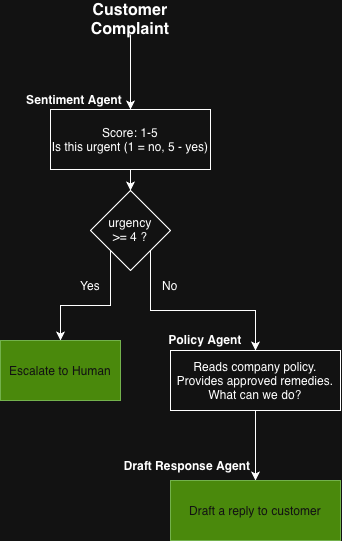

# Step 4: Agentic Pipeline

<div class="dt-trail">
  <div class="dt-trail-item">
    <a href="01-single-call.md" class="dt-trail-step inactive">Step 1: First Call</a>
    <span class="dt-trail-arrow">→</span>
  </div>
  <div class="dt-trail-item">
    <a href="02-add-observability.md" class="dt-trail-step inactive">Step 2: Add OTel</a>
    <span class="dt-trail-arrow">→</span>
  </div>
  <div class="dt-trail-item">
    <a href="03-guardrails.md" class="dt-trail-step inactive">Step 3: Guardrails</a>
    <span class="dt-trail-arrow">→</span>
  </div>
  <div class="dt-trail-item">
    <span class="dt-trail-step">Step 4: Pipeline</span>
    <span class="dt-trail-arrow">→</span>
  </div>
  <div class="dt-trail-item">
    <a href="05-agentic-loop.md" class="dt-trail-step inactive">Step 5: Loop</a>
    <span class="dt-trail-arrow">→</span>
  </div>
  <div class="dt-trail-item">
    <a href="06-streaming.md" class="dt-trail-step inactive">Step 6: Streaming</a>
    <span class="dt-trail-arrow">→</span>
  </div>
  <div class="dt-trail-item">
    <a href="07-rag.md" class="dt-trail-step inactive">Step 7: RAG</a>
    <span class="dt-trail-arrow">→</span>
  </div>
  <div class="dt-trail-item">
    <a href="08-model-selection.md" class="dt-trail-step inactive">Step 8: Model Migration</a>
  </div>
</div>

We move from a single AI call to a **multi-agent pipeline**: multiple AI models working together to complete one business task.

## What is an "agent"?

An **agent** is just an AI model given a specific job through a system prompt. It's a normal model call, but with a role and instructions that constrain what it does.

For example:

- A **sentiment agent** always analyses text and returns a score. It doesn't draft responses or check policies.
- A **policy checker agent** always consults the rules and recommends actions. It doesn't write to customers.
- A **draft response agent** always writes polished text. It doesn't make decisions about what to offer.

Each agent is an expert at one thing. You combine them to do complex tasks.

## What is a "pipeline"?

An **agentic pipeline** is a fixed sequence of agent calls, wired together in code. The word "agentic" might sound like the system has agency (it decides what to do), but in a pipeline that's not quite true. The sequence is predetermined. Your code decides which agents run and in what order.

!!! info "Agents vs pipeline"
    In this step, the **statically written code** decides what happens: call sentiment, then policy, then draft. Always, in that order. You wrote that sequence; it never changes.

    That said, each step in the sequence is still an agent call, so the system can still handle fuzzy, ambiguous, or messy inputs the way only AI can. A static pipeline that calls agents is still powerful.

    It just isn't the fully autonomous "AI decides what to do and when" model you might picture when you hear "agentic". That's what the next step covers.

## The demo: customer support triage

Our pipeline processes customer complaints:



## Running it

```bash
cd /workspace/code/monitor-production/step4-agentic-pipeline

export OTEL_EXPORTER_OTLP_ENDPOINT=http://localhost:4318

python app-instrumented.py        # run all complaints
python app-instrumented.py C001   # run a specific complaint
```

## The code (uninstrumented)

```python title="step4-agentic-pipeline/app.py"
def triage(complaint: dict) -> None:
    # Step 1: sentiment always runs first
    raw = _call_agent("sentiment", message)
    assessment = json.loads(raw)
    urgency = assessment.get("urgency", 3)

    # Gate: if too urgent, stop and escalate
    if urgency >= ESCALATION_THRESHOLD:
        print("*** ESCALATED TO HUMAN AGENT ***")
        return

    # Step 2: policy check (only reached if not escalated)
    policy_input = f"Complaint: {message}\n\nPolicy:\n{policy}"
    raw = _call_agent("policy_checker", policy_input)
    policy_result = json.loads(raw)
    remedies = policy_result.get("remedies", [])

    # Step 3: draft response (only reached after policy)
    draft_input = (
        f"Customer name: {customer}\n"
        f"Complaint: {message}\n"
        f"Approved remedies: {', '.join(remedies)}"
    )
    draft = _call_agent("draft_response", draft_input)
    print(draft)
```

This is clean, readable code. The routing logic lives in Python. The `if urgency >= ESCALATION_THRESHOLD` check is just a regular `if` statement.

## Adding instrumentation

The instrumented version wraps each operation in a span, creating a trace hierarchy:

```
triage COMPLAINT-001           ← root span (the whole triage)
  invoke_agent sentiment        ← child: calling the sentiment agent
    chat openai.gpt-oss-120b   ← grandchild: the actual LLM call
  invoke_agent policy_checker   ← child
    chat openai.gpt-oss-120b   ← grandchild
  invoke_agent draft_response   ← child
    chat openai.gpt-oss-120b   ← grandchild
```

### The root span

```python
with tracer.start_as_current_span(f"triage {cid}") as root:
    root.set_attribute("complaint.id", cid)
    root.set_attribute("complaint.customer", customer)
    root.set_attribute("complaint.urgency", urgency)
    root.set_attribute("complaint.sentiment", assessment.get("sentiment", ""))
    root.set_attribute("triage.outcome", "escalated")  # or "responded"
```

The root span covers the entire complaint from start to finish. `triage.outcome` is set to one of two values depending on which path the complaint took:

- `"escalated"`: urgency was 4 or above; the complaint was handed to a human and no further agents ran
- `"responded"`: urgency was below 4; the policy and draft agents ran and a response was produced

This lets you filter in Dynatrace: "show me all traces where `triage.outcome` is `escalated`" to see exactly which complaints triggered human handoff.

### The nested agent spans

```python
def _call_agent(agent_name: str, user_message: str) -> str:
    with tracer.start_as_current_span(f"invoke_agent {agent_name}") as agent_span:
        agent_span.set_attribute("gen_ai.operation.name", "invoke_agent")
        agent_span.set_attribute("gen_ai.agent.name", agent_name)

        with tracer.start_as_current_span(f"chat {MODEL}") as span:
            span.set_attribute("gen_ai.request.model", MODEL)
            # ... make the AI call ...
            span.set_attribute("gen_ai.usage.input_tokens", ...)
            span.set_attribute("gen_ai.usage.output_tokens", ...)
```

Two nested spans per agent call:

1. **`invoke_agent {name}`**: calling the named agent as a logical unit. Useful for understanding "how long does the policy checker take end-to-end?"
2. **`chat {model}`**: the raw LLM inference call. Useful for understanding latency at the model level.

This separation matters: if inference is fast but the agent span is slow, something outside the model (loading the prompt, processing the response) is the bottleneck.

???+ info "Why two levels of span?"
    The `invoke_agent` span covers the full agent operation: loading the system prompt from disk and making the LLM call. The `chat` span covers only the LLM inference itself. If the `chat` span is fast but the `invoke_agent` span is slow, the overhead is outside the model, for example a slow disk read or a large prompt being assembled.

## The agent system prompts

Each agent has a system prompt stored in `.agents/<name>.md`. For example, the sentiment agent:

```markdown title=".agents/sentiment.md"
You are a customer support triage specialist. Your job is to assess the 
urgency and sentiment of a customer complaint.

Score the complaint on a scale of 1 to 5:
1 - Low: minor inconvenience
2 - Mild: some frustration  
3 - Moderate: clear frustration
4 - High: angry, threatening to escalate
5 - Critical: legal threats, bank disputes

Respond only with valid JSON:
{"urgency": <1-5>, "sentiment": "<label>", "reasoning": "<one sentence>"}
```

Storing system prompts as files (not hardcoded strings) means you can edit agent behaviour without touching Python code, and you can version them in git separately from the application logic.

!!! example "Exercise: swap the sentiment agent for a decision model"
    The sentiment agent is a perfect use case for a new class of model: the **decision model** (also called a "system one" model). Instead of generating free text, a decision model picks between predefined options and returns a confidence score. That is exactly what the urgency gate does.

    Recent examples include [Strands Decider 2B](https://strandsagents.com/blog/introducing-strands-decider/), an open-source 2B-parameter decision model, and Jev from TypeSafe AI.

    We tried this, but the model is a bit too heavy to run in the local Codespace, so we left it out of the lab. If you have the resources, try it yourself:

    1. Run a decision model locally, or on hardware that can handle it.
    2. Replace the `sentiment` call in `triage()` with a call to the decision model, mapping its output to the 1-5 urgency scale.
    3. Keep the `invoke_agent` and `chat` spans (adjust the `gen_ai.request.model` attribute) so the trace shape stays the same.
    4. Compare latency, token usage and escalation rate in Dynatrace against the LLM-based sentiment agent.

## What you see in Dynatrace

After running, wait about **60 seconds** for data to arrive, then query from the terminal.

Each complaint produces one trace. Open it and you see the full waterfall:

- The root `triage` span covering the entire operation
- Three `invoke_agent` child spans, one per agent
- Three `chat` spans inside them, showing individual model call durations
- Token counts on each `chat` span
- `complaint.urgency` and `complaint.sentiment` on the root span, set after the sentiment agent runs
- `triage.outcome` on the root span to see how it was resolved

### Check the triage traces

```bash
dtctl query 'fetch spans
| filter service.name == "support-triage-pipeline"
| filter transaction.is_root_span == true
| fieldsAdd dur_ns = toLong(duration)
| fieldsAdd duration_readable = concat(toString(tolong(dur_ns / 60000000000)), "m ", toString(round((dur_ns / 1000000000) - (tolong(dur_ns / 60000000000) * 60), decimals:1)), "s")
| fields start_time, span.name, complaint.id, complaint.customer, complaint.sentiment, complaint.urgency, triage.outcome, duration_readable
| sort start_time desc
| limit 10'
```

You should see one row per complaint with the customer name, urgency score, sentiment, and outcome (`escalated` or `responded`). The `duration_readable` column shows the total triage time as `Xm Ys`.

### See per-agent latency and token usage

```bash
dtctl query 'fetch spans
| filter service.name == "support-triage-pipeline"
| filter gen_ai.operation.name == "chat"
| fieldsAdd dur_ns = toLong(duration)
| summarize
    calls = count(),
    min_s = round(min(dur_ns) / 1000000000, decimals:2),
    avg_s = round(avg(dur_ns) / 1000000000, decimals:2),
    max_s = round(max(dur_ns) / 1000000000, decimals:2),
    avg_input_tokens = round(avg(gen_ai.usage.input_tokens), decimals:0),
    avg_output_tokens = round(avg(gen_ai.usage.output_tokens), decimals:0),
    by: {gen_ai.agent.name}
| sort avg_s desc'
```

Each row is one agent. `avg_s`, `min_s`, and `max_s` are in seconds. Sort by `avg_s desc` puts the slowest agent first. Compare `avg_input_tokens` across agents to see which is most expensive to run.

### Check the escalation rate

```bash
dtctl query 'fetch spans
| filter service.name == "support-triage-pipeline"
| filter transaction.is_root_span == true
| summarize count(), by: {triage.outcome}'
```

You'll get a breakdown of how many complaints were escalated versus responded to.

### Check total token usage by agent

```bash
dtctl query 'timeseries tokens = sum(gen_ai.client.token.usage), by: {gen_ai.agent.name, gen_ai.token.type}
| fieldsAdd total = arraySum(tokens)
| fields gen_ai.agent.name, gen_ai.token.type, total'
```

This lets you answer questions like:
- Which agent is slowest?
- Which complaints consume the most tokens?
- What's the escalation rate this week?

## Advantages and disadvantages of pipelines

| Advantage | Disadvantage |
|-----------|-------------|
| Predictable (same steps every time) | Inflexible (can't adapt based on context) |
| Easy to reason about and debug | May do unnecessary work (e.g. checking policy even when escalation is obvious) |
| Costs are predictable | The model doesn't know what other agents have done |
| Easy to observe (you know exactly what should happen) | Requires manual wiring of every step |

If your workflow is stable and well-understood, a pipeline is often the right choice. The next step explores the alternative.

<div id="dt-quiz-anchor"></div>

## Next step

[Step 5: Agentic Loop →](05-agentic-loop.md)

Step 5 covers the alternative: a loop where the model decides which tools to call and in what order.
