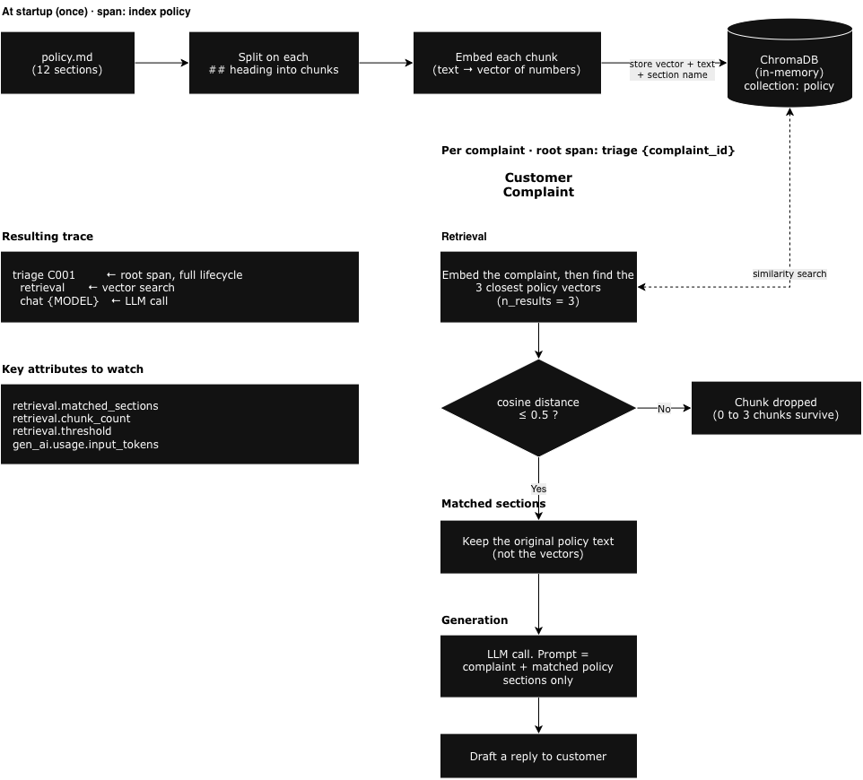

# Step 7: RAG

<div class="dt-trail">
  <div class="dt-trail-item">
    <a href="01-single-call.md" class="dt-trail-step inactive">Step 1: First Call</a>
    <span class="dt-trail-arrow">→</span>
  </div>
  <div class="dt-trail-item">
    <a href="02-add-observability.md" class="dt-trail-step inactive">Step 2: Add OTel</a>
    <span class="dt-trail-arrow">→</span>
  </div>
  <div class="dt-trail-item">
    <a href="03-guardrails.md" class="dt-trail-step inactive">Step 3: Guardrails</a>
    <span class="dt-trail-arrow">→</span>
  </div>
  <div class="dt-trail-item">
    <a href="04-agentic-pipeline.md" class="dt-trail-step inactive">Step 4: Pipeline</a>
    <span class="dt-trail-arrow">→</span>
  </div>
  <div class="dt-trail-item">
    <a href="05-agentic-loop.md" class="dt-trail-step inactive">Step 5: Loop</a>
    <span class="dt-trail-arrow">→</span>
  </div>
  <div class="dt-trail-item">
    <a href="06-streaming.md" class="dt-trail-step inactive">Step 6: Streaming</a>
    <span class="dt-trail-arrow">→</span>
  </div>
  <div class="dt-trail-item">
    <span class="dt-trail-step">Step 7: RAG</span>
    <span class="dt-trail-arrow">→</span>
  </div>
  <div class="dt-trail-item">
    <a href="08-model-selection.md" class="dt-trail-step inactive">Step 8: Model Migration</a>
  </div>
</div>

Retrieval-Augmented Generation (RAG) is a pattern for giving the model access to a large knowledge base without putting it all in the prompt. Before calling the model, you search a vector database for the sections most relevant to the user's request, and pass only those to the model.

This adds a new operation to the trace: the retrieval step.

## Running it

```bash
cd /workspace/code/monitor-production/step7-rag
export OTEL_EXPORTER_OTLP_ENDPOINT=http://localhost:4318

python app-instrumented.py        # run all complaints
python app-instrumented.py C001   # run a specific complaint
```

## What changes

Our demo app uses a company policy document to decide what remedy to offer each customer. Refund rules, replacement timelines, escalation criteria. It's all in there.

When the model needs to respond to a complaint, it needs to know what the policy says. There are two ways to give it that information.

**Option 1: send the whole policy document in every request.** Simple, but every token in that document [costs money and counts against the context window](../foundation/tokens.md). If the policy is 10 pages, you're paying for 10 pages of tokens on every single complaint, even though a complaint about a late delivery only needs the shipping policy section.

**Option 2: figure out which sections of the policy are relevant to this specific complaint, and only send those.** Much cheaper. But how do you do that automatically, for every complaint, without reading the document yourself?

RAG solves this by running a similarity search against the policy document before calling the model. The search finds the sections most likely to be relevant to the complaint and returns just those. The model only ever sees the parts it actually needs.

The trace now has three spans under the root instead of one:

```
triage {complaint_id}         ← root span, full lifecycle
  retrieval                   ← vector similarity search
  chat {MODEL}                ← LLM call with retrieved context only
```

## How the policy gets into the vector store



Before RAG can work, the policy document has to be loaded into a vector store. This is called indexing, and it happens once at startup, before any complaint is processed.

Here is what the app does:

1. **Split the document into sections.** The policy is a markdown file. The app reads it and breaks it into chunks, one per `##` heading. Each chunk is one self-contained policy section, such as "Shipping delays" or "Refund eligibility".

2. **Convert each chunk into a vector.** A vector is a list of numbers that represents the meaning of a piece of text. The vector store handles this automatically when you add a document. Texts that mean similar things end up with similar vectors, even if they use different words. For example, "my parcel never arrived" and "item not delivered" would produce very similar vectors, so a complaint with either phrase would match the shipping policy section. "I want a refund" would produce a different vector and match the refund policy section instead.

3. **Store the vectors.** Each chunk and its vector are saved in the vector store, tagged with the name of the section it came from. The section name is stored as metadata so that after a search you know not just what text was returned but where in the policy it came from. That is what populates `retrieval.matched_sections` in the trace.

When a complaint arrives, the same process runs on the complaint text. The complaint "my delivery is late" is converted to a vector. The vector store compares that vector against every stored policy vector and finds the closest matches. In this case the "Late deliveries" section would score as highly similar, while "Refund eligibility" and "Warranty claims" would score as distant. The vector store then returns the original text of the matching sections, not the numbers. The numbers were only ever a lookup mechanism. The model receives the actual policy wording, just the one or two sections that are relevant, and nothing else from the document. That is the retrieval step.

The indexing runs once at startup, separate from any complaint trace. The app wraps it in its own span named `index policy`, with `policy.file` and `policy.section_count` as attributes, so you can see it in Dynatrace alongside the per-complaint traces and confirm the index was built correctly before any complaints were processed. You will also see `Indexed N policy sections` printed in the terminal.

In this demo app, the vector database (we use ChromaDB) is running entirely in-memory bundled in the application code.

## The retrieval span

The retrieval step is a child span with its own instrumentation:

```python
with tracer.start_as_current_span("retrieval") as span:
    span.set_attribute("gen_ai.operation.name", "retrieval")
    span.set_attribute("db.system.name",        "chroma")
    span.set_attribute("db.operation.name",     "query")
    span.set_attribute("db.collection.name",    "policy")
    span.set_attribute("retrieval.query",        query)
    span.set_attribute("retrieval.n_results",    n)

    results = collection.query(query_texts=[query], n_results=n)
    chunks  = results["documents"][0]
    metas   = results["metadatas"][0]

    matched = [m["section"] for m in metas]
    span.set_attribute("retrieval.matched_sections", json.dumps(matched))
    span.set_attribute("retrieval.chunk_count",      len(chunks))

    retrieval_results.record(len(chunks), {
        "gen_ai.operation.name": "retrieval",
    })
```

`gen_ai.operation.name = "retrieval"` follows the OTel GenAI semantic conventions for vector search operations. `db.system.name`, `db.operation.name`, and `db.collection.name` follow the [OTel database semantic conventions](https://opentelemetry.io/docs/specs/semconv/database/) and identify this as a ChromaDB query against the `policy` collection — Dynatrace uses these to correlate the span with the vector store as a backing service. The span duration covers the embedding of the query and the similarity search, so you can see vector store latency separately from LLM latency in the trace waterfall.

The key attribute here is `retrieval.matched_sections`. It records which policy sections were actually returned, so you can answer "what context did the model see?" directly from the trace, without re-running the query.

### Why record matched sections on the root span too?

```python
root.set_attribute("retrieval.matched_sections",
                   json.dumps([c.split("\n")[0] for c in relevant_chunks]))
```

The retrieval child span already has this. Duplicating it on the root span lets you filter complaints by which policy sections were triggered at the trace level, without drilling into child spans every time. It's a small redundancy that makes Dynatrace queries much easier to write.

## The new metric

```python
retrieval_results = meter.create_histogram(
    name="rag.retrieval.chunk_count",
    unit="{chunk}",
    description="Number of policy chunks retrieved per complaint",
)
```

This tracks how many chunks are returned per complaint. A consistently low value means the retrieval is focused. A high value suggests the query is too broad, or the policy chunks are not semantically distinct enough from each other.

### What "good" and "bad" actually look like

Before setting an alert on this metric, check how your vector database (we use the open source vector database [ChromaDB](https://github.com/chroma-core/chroma) for this demo) is configured, because that determines whether the metric can vary at all.

```python title="step7-rag/app-instrumented.py"
RETRIEVAL_THRESHOLD = 0.5

chroma     = chromadb.Client()
collection = chroma.create_collection(
    "policy",
    metadata={"hnsw:space": "cosine"},
)
```

```python
results   = collection.query(query_texts=[query], n_results=n)
chunks    = results["documents"][0]
distances = results["distances"][0]

chunks = [c for c, d in zip(chunks, distances) if d <= RETRIEVAL_THRESHOLD]
metas  = [m for m, d in zip(metas,  distances) if d <= RETRIEVAL_THRESHOLD]
```

ChromaDB supports three distance functions: `l2` (the default), `cosine`, and `ip` (inner product). The choice affects which chunks get returned for a given query. For semantic text search, `cosine` is a good starting point: it measures how similar two pieces of text are in meaning, regardless of their length. See the [ChromaDB docs](https://docs.trychroma.com/docs/collections/configure) for guidance on when to use each.

This demo uses `cosine` with a threshold of `0.5`. Cosine distance runs from 0 (identical meaning) to 1 (completely unrelated), so anything above 0.5 gets dropped. This means `chunk_count` can now be anywhere from 0 to `n_results` depending on how well the complaint matches the policy, so the metric actually varies and alerting on it is meaningful.

The threshold is also recorded on the retrieval span (`retrieval.threshold`), so you can see it alongside the chunk count in Dynatrace and adjust it if results feel too broad or too narrow.

To tune it with data instead of guesses, the span also records the raw cosine distances from before the filter runs:

```python
span.set_attribute("retrieval.min_distance", min(distances) if distances else 1.0)
span.set_attribute("retrieval.distances",    json.dumps([round(d, 3) for d in distances]))
```

`retrieval.min_distance` is how far the closest policy section was from the complaint. Smaller means a better match. If it is bigger than `retrieval.threshold`, nothing was good enough and the model saw no policy text.

Raising the threshold lets looser matches through. Lowering it is stricter.

Query it from the terminal (after running the app and waiting about 60 seconds):

```bash
dtctl query 'fetch spans
| filter service.name == "support-rag"
| filter gen_ai.operation.name == "retrieval"
| fieldsAdd missed_by = retrieval.min_distance - retrieval.threshold
| fields start_time, retrieval.query, retrieval.min_distance, retrieval.threshold, retrieval.chunk_count, missed_by
| sort start_time desc
| limit 10'
```

A positive `missed_by` means the complaint just missed the cut-off and the model saw no policy text. If it only misses by a little, raise `RETRIEVAL_THRESHOLD` in `app-instrumented.py` and re-run. If it misses by a lot, the policy probably has no section covering that complaint.

Once you have score-based filtering, the patterns to watch for are:

| Pattern | What it suggests |
|---|---|
| `chunk_count` consistently below `n_results` | Retrieval is focused; queries match specific sections clearly |
| `chunk_count` consistently at `n_results` (the cap) | Threshold may be too loose; everything is matching |
| `chunk_count` dropping suddenly | Policy chunks no longer match incoming queries. Possible causes: the policy document changed, or complaint language has shifted |
| High variance across complaints | Some query types have clear policy matches; others don't. Points to gaps in the knowledge base |

The raw count alone is not enough. Pair it with `gen_ai.usage.input_tokens` on the `chat` span: high chunk_count with high input tokens means you're paying for broad retrieval. Low chunk_count with degraded answers means the retrieval is too narrow.

The baseline for what is "high" also depends on your `n_results` setting. The ratio `chunk_count / n_results` is more portable than the raw number when comparing across different configurations.

## Is RAG cheaper than the agentic pipeline?

It depends on what you're comparing.

For a small policy document, the agentic pipeline sends the whole policy file to the policy checker on every complaint. RAG retrieves 3 chunks and sends about 100 tokens. So RAG uses fewer tokens for the policy context. But the pipeline makes three LLM calls (sentiment, policy checker, draft) while RAG makes one. You're not comparing like for like.

???+ info "The real case for RAG is scalability, not cost"
    The point is not that RAG is cheaper than the pipeline at small scale. It's that the pipeline approach breaks when the policy grows.

    When the policy reaches 500 pages covering every product, region, warranty clause, and edge case, you cannot fit it in a prompt. Even if you could, you'd be paying for 500 pages of tokens on every single complaint, and [model attention degrades when given a huge irrelevant document](https://arxiv.org/abs/2307.03172).

    RAG solves that. The knowledge base can be 10,000 pages and you still only ever send 3 relevant chunks to the model. Cost and quality both scale well.

| | Agentic pipeline | RAG |
|---|---|---|
| **LLM calls per complaint** | 3 | 1 |
| **Policy tokens sent** | All of it | ~3 chunks |
| **Works with a 500-page policy** | No | Yes |
| **Trace structure** | 3 child spans | retrieval + chat |

## What you'll see in Dynatrace

After running, wait about **60 seconds** for data to arrive, then query from the terminal.

Each trace has three spans. Open one and you'll see:

- The root `triage` span with `complaint.id`, `complaint.customer`, and `retrieval.matched_sections`
- A `retrieval` child span showing the query, how many chunks were requested, and which sections were returned. Duration here is the vector search latency.
- A `chat` child span with the full GenAI attributes (model, token counts, input/output messages). Duration here is the LLM latency.

### Check how many chunks were indexed and how long indexing took

```bash
dtctl query 'fetch spans
| filter service.name == "support-rag"
| filter span.name == "index policy"
| fieldsAdd index_duration_s = round(toLong(duration) / 1000000000, decimals:2)
| fields start_time, policy.file, policy.section_count, index_duration_s
| sort start_time desc
| limit 10'
```

`policy.section_count` is the number of chunks added to the vector store (one per `##` heading), and `index_duration_s` is the length of the `index policy` span. This should match the `Indexed N policy sections` line printed in the terminal. If the count is lower than the number of `##` headings in the policy file, the document was not split as expected.

### Check triage traces with matched policy sections

```bash
dtctl query 'fetch spans
| filter service.name == "support-rag"
| filter transaction.is_root_span == true
| fields start_time, complaint.id, complaint.customer, retrieval.matched_sections
| sort start_time desc
| limit 10'
```

`retrieval.matched_sections` shows exactly which policy sections the model saw for each complaint — no need to re-run the query to find out.

### Compare retrieval vs LLM latency

```bash
dtctl query 'fetch spans
| filter service.name == "support-rag"
| filter gen_ai.operation.name in ("retrieval", "chat")
| fieldsAdd dur_ns = toLong(duration)
| summarize
    calls = count(),
    avg_s = round(avg(dur_ns) / 1000000000, decimals:2),
    max_s = round(max(dur_ns) / 1000000000, decimals:2),
    by: {gen_ai.operation.name}
| sort avg_s desc'
```

If `retrieval` latency is close to `chat` latency, the vector store is a meaningful part of your response time. If it is near zero, the bottleneck is entirely in the model.

### Check retrieval chunk counts

```bash
dtctl query 'fetch spans
| filter service.name == "support-rag"
| filter gen_ai.operation.name == "retrieval"
| fields start_time, db.system.name, db.collection.name, retrieval.query, retrieval.chunk_count, retrieval.n_results, retrieval.threshold
| sort start_time desc
| limit 10'
```

`db.system.name` confirms the vector store backend (`chroma`) and `db.collection.name` identifies the collection queried. Compare `retrieval.chunk_count` against `retrieval.n_results`. If chunk count consistently equals n_results, the threshold may be too loose — everything is matching. If it is consistently low or zero, the retrieval is too narrow for some complaint types.

### Check chunk count metric over time

```bash
dtctl query 'timeseries chunks = avg(rag.retrieval.chunk_count)
| fieldsAdd avg_chunks = arrayAvg(chunks)
| fields avg_chunks'
```

In **Metrics**, `rag.retrieval.chunk_count` shows whether your retrieval is returning focused results or casting too wide a net.

<div id="dt-quiz-anchor"></div>

## What's next?

You've now instrumented every shape of AI operation this app makes: a single call, a fixed pipeline, an autonomous loop, streaming, and retrieval. In [Step 8](08-model-selection.md), we put that instrumentation to work on a production decision: migrating from one model to another with real traffic data to justify the move.

[Step 8: Model Migration →](08-model-selection.md)
